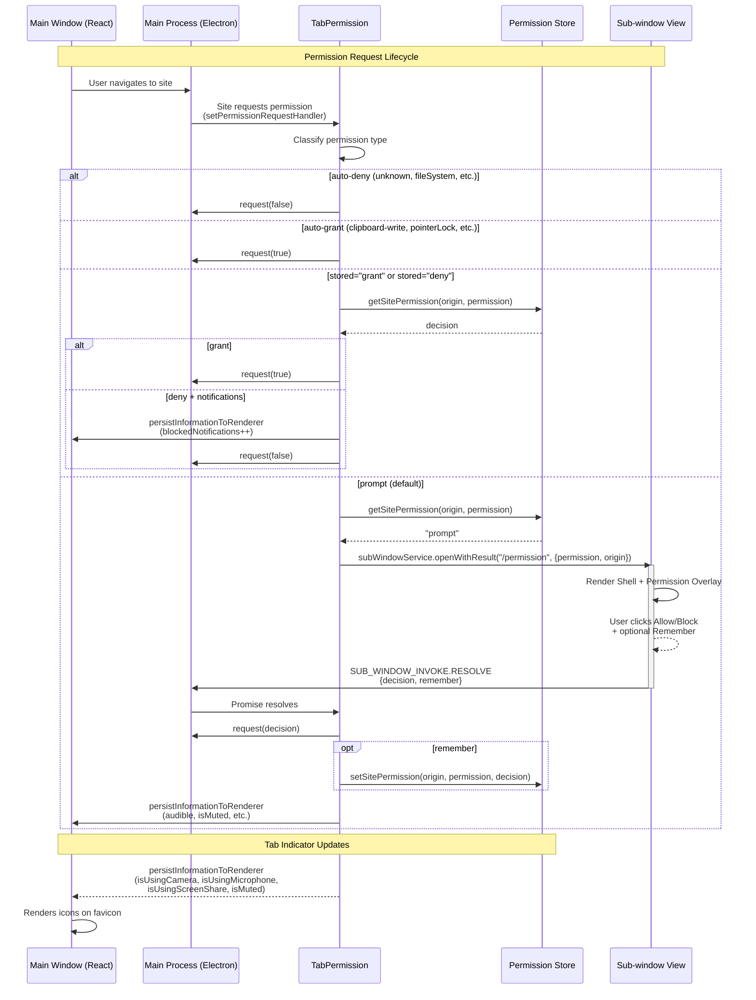
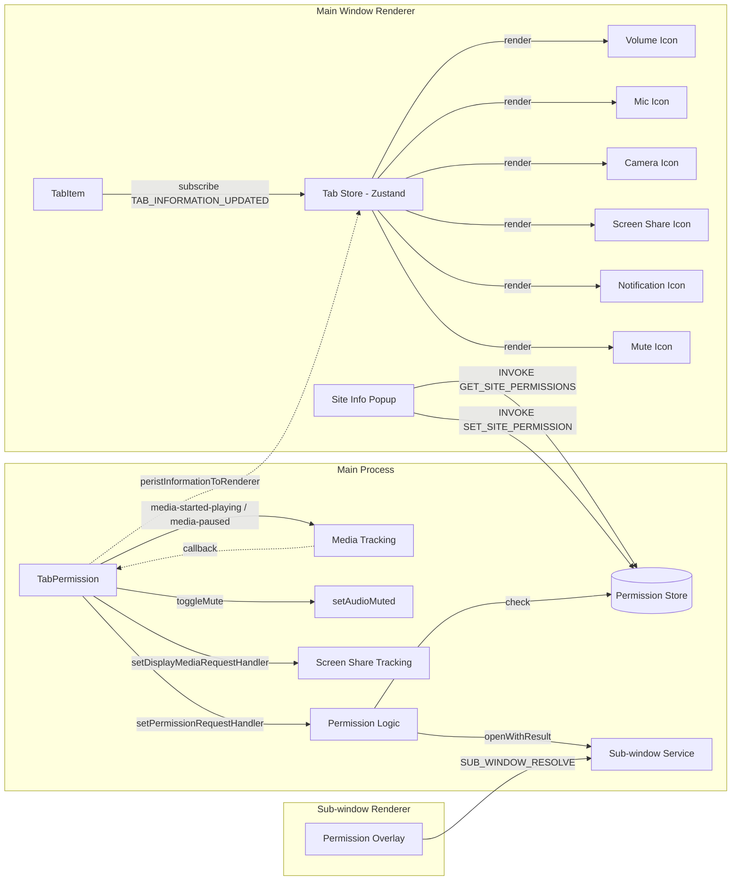

# Tab Permissions & Indicators Plan

## Current State

The codebase has minimal permission handling compared to Chrome:

| Feature                                                               | Status                                                  |
| --------------------------------------------------------------------- | ------------------------------------------------------- |
| **Audio indicator** (tab shows speaker icon)                          | ✅ Exists (`IconVolume` on favicon when `audible=true`) |
| **Mute tab** (click to mute audio)                                    | ❌ Not implemented                                      |
| **Mic/Camera indicator** (red dot when recording)                     | ❌ Not implemented                                      |
| **Screen share indicator**                                            | ❌ Not implemented                                      |
| **Notification indicator** (bell icon in URL bar)                     | ❌ Not implemented                                      |
| **Permission prompts** (dialogs for geolocation, notifications, etc.) | ❌ All permissions auto-granted with no user prompt     |
| **Per-site permission storage** (remember decisions)                  | ❌ Not implemented                                      |
| **Site info popup** (click lock in URL bar)                           | ❌ Not implemented                                      |
| **Site settings** (manage permissions for sites)                      | ❌ Not implemented                                      |

### Current permission handler

`src/features/tabs/models/tab.ts` — `requestPermissions()` method:

- **`setDisplayMediaRequestHandler`**: Always provides the requesting frame's video with system picker enabled.
- **`setPermissionRequestHandler`**: Denies `unknown`, `fileSystem`, `storage-access`, `top-level-storage-access`, `mediaKeySystem`. **Auto-grants everything else** (notifications, geolocation, camera, mic, clipboard, MIDI, serial, USB, HID, etc.).
- **`setWindowOpenHandler`**: All popups redirected to new tabs via `CREATE_TAB` IPC.

### Existing tab indicator

- Tab model has single `audible: boolean` property, updated via Electron's `audio-state-changed` event.
- UI renders `IconVolume` overlaid on the top-left of the favicon when `tab.audible` is `true`.
- No mute interaction, no other indicators.

---

## Implementation Phases

### Phase 1: Shared Types & IPC Channels

**New file:** `src/shared/types/permission.d.ts`

```typescript
export type PermissionType =
  | 'geolocation'
  | 'notifications'
  | 'microphone'
  | 'camera'
  | 'media'
  | 'clipboard-read'
  | 'clipboard-write'
  | 'midi'
  | 'midiSysex'
  | 'pointerLock'
  | 'fullscreen'
  | 'openExternal'
  | 'serial'
  | 'usb'
  | 'hid'
  | 'storage-access'
  | 'mediaKeySystem'
  | 'fileSystem'
  | 'unknown'

export type PermissionDecision = 'grant' | 'deny' | 'prompt'

export interface SitePermissions {
  [permission: string]: PermissionDecision
}

export interface PermissionRequest {
  requestId: string
  permission: PermissionType
  origin: string
}
```

**File:** `src/shared/constants/ipc.ts`

Add IPC channels:

- `EMIT_CHANNEL` add: `TOGGLE_MUTE_TAB`
- Invoke channels add: `GET_SITE_PERMISSIONS`, `SET_SITE_PERMISSION`, `RESET_SITE_PERMISSION`, `RESET_ALL_PERMISSIONS`

Permission prompts use the existing `SUB_WINDOW_INVOKE.RESOLVE` channel — no new renderer IPC needed.

**File:** `src/shared/types/tab.d.ts`

Add to `ITab`:

```typescript
isMuted?: boolean;
isUsingCamera?: boolean;
isUsingMicrophone?: boolean;
isUsingScreenShare?: boolean;
blockedNotifications?: number;
```

---

### Phase 2: Permission Store (Persistence)

**New file:** `src/main/core/stores/permission.store.ts`

- Use existing `StoreManager` pattern (like bookmark/history stores).
- Load/save per-site permission map from `permission.json`.
- Keyed by origin (e.g., `"https://example.com"`).
- Each entry maps permission type → `"grant" | "deny" | "prompt"` (default `"prompt"`).
- Expose methods:
  - `getSitePermission(origin, permission): PermissionDecision`
  - `getSitePermissions(origin): SitePermissions`
  - `setSitePermission(origin, permission, decision): void`
  - `resetSitePermission(origin, permission): void`
  - `resetAllPermissions(): void`
  - `getAllSites(): string[]`

---

### Phase 3: Enhanced Permission Handler (Main Process)

**New file:** `src/features/tabs/models/permission.ts`

Permission logic extracted to a `TabPermission` base class that `Tab` extends. This keeps the permission/mute/media-tracking concerns separated.

#### 3a. Smart Permission Request Handler

Permission request handler in `TabPermission.requestPermissions()`:

```
1. Extract origin from requesting URL
2. Check PermissionStore for stored decision:
   - "grant" → immediately grant
   - "deny" → immediately deny
   - "prompt" (default) → call subWindowService.openWithResult("/permission", { permission, origin })
3. Sub-window overlay shows Permission prompt → user decides
4. Sub-window resolves promise with { decision, remember }
5. If "remember" checked, save to PermissionStore
6. Call request(decision) to resolve Electron's permission callback
```

Permission types that should show prompt by default:

- `geolocation`, `notifications`, `microphone`, `camera`, `media`
- `clipboard-read` (clipboard-write can be auto-granted for user-initiated actions)

Permission types that can be auto-granted:

- `clipboard-write`, `pointerLock`, `fullscreen`, `midi`, `midiSysex`

Permission types that should be auto-denied:

- `unknown`, `fileSystem`, `storage-access`, `top-level-storage-access`, `mediaKeySystem`

#### 3b. Media Usage Tracking

Add event listeners in `createView()`:

```typescript
// Track camera/mic usage
this._view.webContents.on('media-started-playing', (mediaType) => {
  // Electron passes mediaType: "video", "audio", "video_input", "audio_input"
  if (mediaType === 'video_input') {
    this.isUsingCamera = true
  }
  if (mediaType === 'audio_input') {
    this.isUsingMicrophone = true
  }
  this.persistInformationToRenderer({ isUsingCamera: this.isUsingCamera, isUsingMicrophone: this.isUsingMicrophone })
})

this._view.webContents.on('media-paused', (mediaType) => {
  if (mediaType === 'video_input') {
    this.isUsingCamera = false
  }
  if (mediaType === 'audio_input') {
    this.isUsingMicrophone = false
  }
  this.persistInformationToRenderer({ isUsingCamera: this.isUsingCamera, isUsingMicrophone: this.isUsingMicrophone })
})
```

_Note: The actual `mediaType` parameter behavior depends on Electron version. Fallback: use a combination of `audio-state-changed`, `media-started-playing`/`media-paused`, and permission request tracking to infer camera/mic state._

#### 3c. Mute Toggle

Add methods to Tab class:

```typescript
toggleMute() {
  if (!this._view) return;
  this.isMuted = !this.isMuted;
  this._view.webContents.setAudioMuted(this.isMuted);
  this.persistInformationToRenderer({ isMuted: this.isMuted });
}
```

Wire up in ViewController: handle `TOGGLE_MUTE_TAB` IPC → `tabController.toggleMute(tabId)`.

#### 3d. Notification Blocking Tracking

In permission handler, when notifications are denied by user preference or stored decision, increment counter and persist to renderer.

#### 3e. Screen Share Tracking

In the `setDisplayMediaRequestHandler`, set `isUsingScreenShare = true` when active, and listen for stream stop to reset.

---

### Phase 4: Tab Indicator UI (Renderer)

**File:** `src/renderer/main-window/src/components/tab/index.tsx`

Replace the simple `IconVolume` with comprehensive indicators:

```tsx
<div className="relative flex">
  <Avatar src={tab?.favicon} />

  {/* Audio indicator */}
  {tab?.audible && !tab?.isMuted && (
    <div className="indicator-audio" onClick={handleMuteToggle}>
      <IconVolume size={12} />
    </div>
  )}

  {/* Muted indicator */}
  {tab?.isMuted && (
    <div className="indicator-muted" onClick={handleMuteToggle}>
      <IconVolumeOff size={12} />
    </div>
  )}

  {/* Camera indicator */}
  {tab?.isUsingCamera && (
    <div className="indicator-camera" title="Camera in use">
      <span className="red-dot" />
      <IconVideo size={10} />
    </div>
  )}

  {/* Microphone indicator */}
  {tab?.isUsingMicrophone && (
    <div className="indicator-mic" title="Microphone in use">
      <span className="red-dot" />
      <IconMicrophone size={10} />
    </div>
  )}

  {/* Screen share indicator */}
  {tab?.isUsingScreenShare && (
    <div className="indicator-screenshare" title="Screen sharing">
      <IconScreenShare size={10} />
    </div>
  )}

  {/* Notification blocked indicator */}
  {tab?.blockedNotifications > 0 && (
    <div className="indicator-notifications" title={`${tab.blockedNotifications} notifications blocked`}>
      <IconBellOff size={10} />
      {tab.blockedNotifications > 1 && <span className="badge-count">{tab.blockedNotifications}</span>}
    </div>
  )}
</div>
```

**File:** `src/renderer/main-window/src/components/tab/styles.module.css`

Add styles for indicators:

- `.indicator-audio`, `.indicator-muted`, `.indicator-camera`, `.indicator-mic`, `.indicator-screenshare`, `.indicator-notifications` — positioned absolute over favicon corners
- `.red-dot` — 4px red circle for live recording indication
- `.badge-count` — small count badge for notification blocks
- Hover states and cursor pointer for interactive indicators (mute toggle)

**File:** `src/renderer/main-window/src/pages/customApp/index.tsx`

- Ensure new tab indicator props are passed to `TabItem`

**File:** `src/main/core/controller/viewController.ts`

- Add IPC handler for `TOGGLE_MUTE_TAB`:
  ```typescript
  case "TOGGLE_MUTE_TAB": {
    const tab = tabController.getTabById(event.data.tabId);
    if (tab) tab.toggleMute();
    break;
  }
  ```

---

### Phase 5: Permission Prompt Dialog (Sub-window Overlay)

Uses the **sub-window** system (same as Vault, Spotlight, Translate, UserScript). A separate `WebContentsView` overlays the main window at fullscreen with a transparent background, ensuring the dialog is always on top.

**New file:** `src/features/permission/overlay/App.tsx`

Overlay component rendered inside a `<Shell>` backdrop:

- Reads payload from `sessionStorage` (set by main process via `openWithResult`)
- Shows site origin, permission type label
- "Allow" / "Block" buttons
- "Remember this decision" checkbox
- Calls `SUB_WINDOW_INVOKE.RESOLVE` to return `{ decision, remember }` to main process
- Calls `SUB_WINDOW_RENDERER_EVENT.CLOSE` to dismiss

**New file:** `src/features/permission/overlay.register.ts`

Registers the overlay at route `/permission` in the sub-window registry.

**Integration:**

- Imported in `src/renderer/sub-window/main.tsx` (side-effect import)
- `@source` path added in `src/renderer/sub-window/assets/styles.css`
- Triggered from `TabPermission.requestPermissions()` via `subWindowService.openWithResult("/permission", { permission, origin })`
- Promise resolves when user responds → `request(decision)` called + optional permission store save

---

### Phase 6: Site Info Popup (Renderer)

**File:** `src/renderer/main-window/src/components/header.tsx`

- Add site info button next to the URL (lock/globe icon)
- Click opens popover showing:
  - Site origin with favicon
  - Connection security (currently no SSL tracking — future enhancement)
  - List of permissions and current status for this site
  - Quick toggle for each permission (Allow / Block / Prompt)
  - "Site Settings" link → opens settings page

---

### Phase 7: Site Settings Page (Renderer)

**File:** `src/renderer/main-window/src/pages/setting/index.tsx`

- New "Site Settings" tab in settings page
- Shows all sites with custom (non-default) permissions
- Each site entry shows origin and list of permissions with status
- Inline toggles for each permission
- "Reset all permissions" button
- "Reset this site" per-site button

---

### Phase 8: OS-Level Media Indicators (macOS)

**File:** `src/main/index.ts`

- Extend mic request to also request camera at startup:
  ```typescript
  if (process.platform === 'darwin') {
    for (const media of ['microphone', 'camera'] as const) {
      const status = systemPreferences.getMediaAccessStatus(media)
      if (status === 'not-determined') {
        await systemPreferences.askForMediaAccess(media)
      }
    }
  }
  ```
- macOS 14+ automatically shows orange/green recording indicator dot in menu bar when camera/mic is in use, so this just ensures the app has OS-level permission to use them.

---

## Architecture Diagram



**Tab Indicator & Site Info Flow:**



---

## Files Summary

| File                                                                     | Action     | Purpose                                                        |
| ------------------------------------------------------------------------ | ---------- | -------------------------------------------------------------- |
| `src/shared/types/permission.d.ts`                                       | **Create** | Permission type enums and interfaces                           |
| `src/shared/constants/ipc.ts`                                            | **Edit**   | Add permission/mute IPC channels                               |
| `src/shared/types/tab.d.ts`                                              | **Edit**   | Add indicator fields to ITab                                   |
| `src/main/core/stores/permission.store.ts`                               | **Create** | Per-site permission persistence                                |
| `src/features/tabs/models/permission.ts`                                 | **Create** | TabPermission base class — handler, media tracking, mute       |
| `src/features/tabs/models/tab.ts`                                        | **Edit**   | Extends TabPermission; removed inline permission logic         |
| `src/main/core/controller/viewController.ts`                             | **Edit**   | Wire mute IPC, permission CRUD handlers, init permission store |
| `src/renderer/main-window/src/components/tab/index.tsx`                  | **Edit**   | Comprehensive indicator UI with mute toggle                    |
| `src/renderer/main-window/src/pages/customApp/index.tsx`                 | **Edit**   | Pass indicator state to TabItem                                |
| `src/features/permission/overlay/App.tsx`                                | **Create** | Sub-window permission prompt overlay                           |
| `src/features/permission/overlay.register.ts`                            | **Create** | Register /permission route in sub-window registry              |
| `src/renderer/sub-window/main.tsx`                                       | **Edit**   | Import permission overlay register                             |
| `src/renderer/sub-window/assets/styles.css`                              | **Edit**   | Add @source for permission                                     |
| `src/renderer/main-window/src/components/header.tsx`                     | **Edit**   | Site info popup with permission toggles                        |
| `src/renderer/main-window/src/pages/setting/index.tsx`                   | **Edit**   | Add "Site Settings" tab                                        |
| `src/renderer/main-window/src/pages/setting/components/SiteSettings.tsx` | **Create** | Site settings management UI                                    |
| `src/main/index.ts`                                                      | **Edit**   | macOS camera + mic OS-level permission request                 |

---

## Priority Order

1. **Phase 3b + 4** — Tab indicators (audio mute, mic/camera, notifications, screen share) — visible feedback, medium effort
2. **Phase 1 + 3a + 5** — Permission prompts — security-critical, prevents auto-granting everything
3. **Phase 2** — Permission store — needed for "remember" feature
4. **Phase 3c** — Mute toggle — natural companion to audio indicator
5. **Phase 6** — Site info popup — user-friendly permission management
6. **Phase 7** — Site settings page — full management UI
7. **Phase 8** — macOS media indicators — polish
